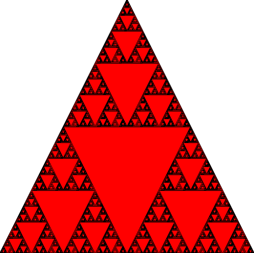

# Sierpinski's Triangle
## This code draws the Sierpinski's fractal.

In order to execute the code you have to install the SFML library.

Use the following command on Ubuntu: ``sudo apt-get install libsfml-dev``

An example of what you can get:

            Sierpinski's triangle after 9 iterations
